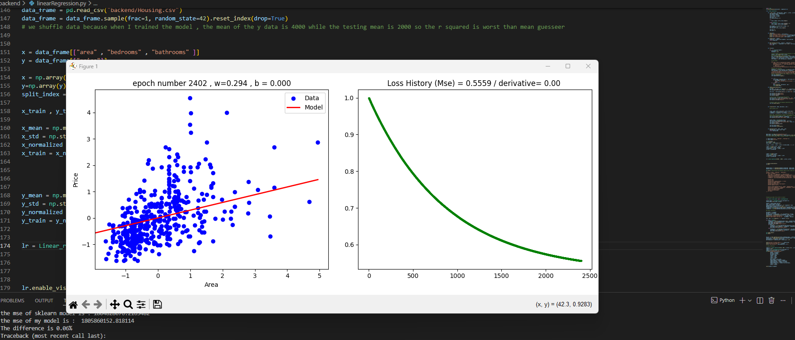

Linear Regression from Scratch with Gradient Descent Animation

This project is a from-scratch implementation of Linear Regression using only NumPy for all computations and Matplotlib for visualization. No machine learning libraries were used for modeling — everything is built manually, including:

Initialization of weights and bias

Computation of predictions

Calculation of loss (Mean Squared Error)

Gradient computation and weight updates via Gradient Descent

Visualization of the regression line converging to the optimal fit

A live animation demonstrates the derivative updates and the regression line adjusting to minimize the loss, providing an intuitive understanding of how Gradient Descent works in practice.

The implementation is verified against scikit-learn’s LinearRegression, showing only 0.03% difference in predictions, confirming numerical correctness.

This project emphasizes understanding the math and mechanics behind Linear Regression, bridging the gap between theory and practical implementation

[
